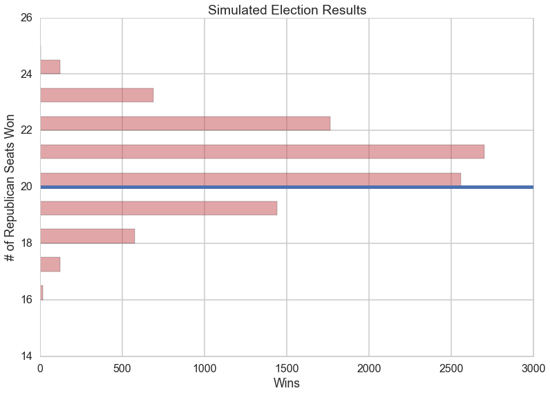
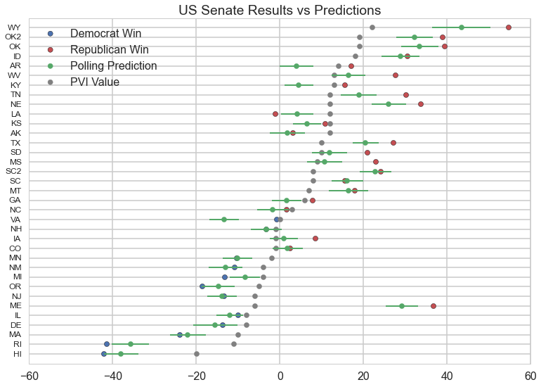
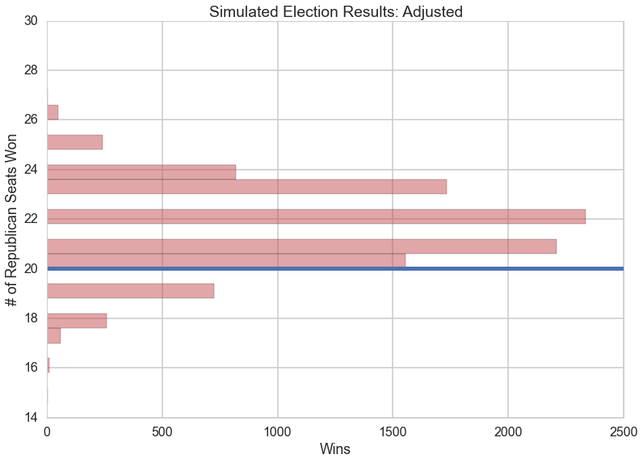

## Do We Need a Better Crystal Ball?  Revisting the 2014 Senate Polls

10/8/2015

Gallup, a pioneer in modern election polling, yesterday announced that they will not be conducting polling for the 2016 presidential primaries, and may also drop the presidential election1.  They did not comment on whether they would also abandon Congressional polling, but their announcement raises questions about the future of national polls.  Are nationwide polls still a valid predictor of future election results?

In mid-September 2014, the New York Times' polling analysis was predicting a close race between Democrats and Republicans for control of the Senate2.  A week before the election, predictions now favored Republicans, but the Times was cautioning that the polls may be under-representing Democrat support3, suggesting that the Republican advantage may be inaccurate due to sampling bias.  By 11/3, the eve of the election, the Times was now predicting that the Republicans had a 73% chance of winning the Senate, while the Washington Post predicted 96%4.  While the Times' final prediction of the Republicans holding 53 seats was close (they ended up with 54), this prediction was based not only on poll results.  To achieve the best possible predictions, and to offset potentially biased poll data, factors such as campaign fund-raising and individual candidate experience were also introduced5.  But how accurate were predictions made using just the poll data, and how could the predictions made using the same data be so far apart?

To find out, we've analyzed the results of nearly 800 polls which were available just prior to the 2014 Senate election.  After applying some basic weighting factors to account for poll age and margin of error, we then calculated the probabilities for each race.  Our simulations excluded the state of Alabama, as the Republicans were running against a third party candidate.  For our tests, then, we are considering 20 wins being the margin for a Republican majority.  The results of 10,000 simulated elections gave the Republicans a 79% chance of winning the required 20 races, with a most likely outcome of the Republicans holding 52 seats, two short of the actual results:

######Graph showing the results of 10,000 simulated elections, based on random polls conducted between 12/2012 and 11/2014.  The horizontal line shows the 21 wins required for a Republican Senate majority.
---

On a state-by-state basis, we find that some polls were quite accurate, while others fell short of the actual results.  The following graph compares the poll-based predictions with the actual results, along with the [Partisan Voting Index](https://en.wikipedia.org/wiki/Cook_Partisan_Voting_Index), which compares each state's political leaning relative to the national average based on House election data:

######Comparing 2014 State Senate predictions and results with the Partisan Voting Index (PVI).  States on the upper right are more likely to vote Republican, and those on the lower left more likely vote Democrat.  Error bars indicate the mean Margin of Error for each state's polls.
---

In addition to considering state level political bias in the PVI data, we looked at House election results going back to 1898 to look at the effect of incumbency on a candidate's chances.  We found that, since 1960, incumbent House candidates had a statistically significant advantage.

So, we can account for some state level biases, but how do we account for nationwide political trends?  Following the high water mark of the pro-Democrat wave in the 2008 elections, Democrat support has ebbed.  To measure this national swing, we've analyzed data from Huffpost comparing House results between 2008 and 2014, which indicate that a Democrat candidate running in 2008 would have had an advantage of approximately 10.5 points over 2014.

After applying adjustments to account for these factors, we re-ran our simulations, and found a nearly 90% chance of a Republican Senate majority, and a most likely outcome of the Republicans holding 53 seats (one short of the actual 54):

######Results of 100000 simulated elections, weighted with PVI and 2014 House election data
---

It seems, then, that our polls do contain value, but we obtained our best predictions after applying a weighting factor which was not available before the election.  The polls provided us with a useful, if imprecise, measure of votes overall, but they underestimated the extent of the Republican swing.  It seems that Gallup may have come to the conclusion that, as a predictor of national opinion, voter polls may not be trustworthy.  But, we find that there is still value in our crystal ball, for those who can divine how to interpret them.

Sources: 
1: http://fivethirtyeight.com/datalab/gallup-gave-up-heres-why-that-sucks 
2,5: http://www.nytimes.com/newsgraphics/2014/senate-model/ 
3: http://www.nytimes.com/2014/10/30/upshot/why-polls-tend-to-undercount-democrats.html 
4: http://www.washingtonpost.com/news/the-fix/wp/2014/11/03/the-senate-will-go-republican-say-the-election-models/